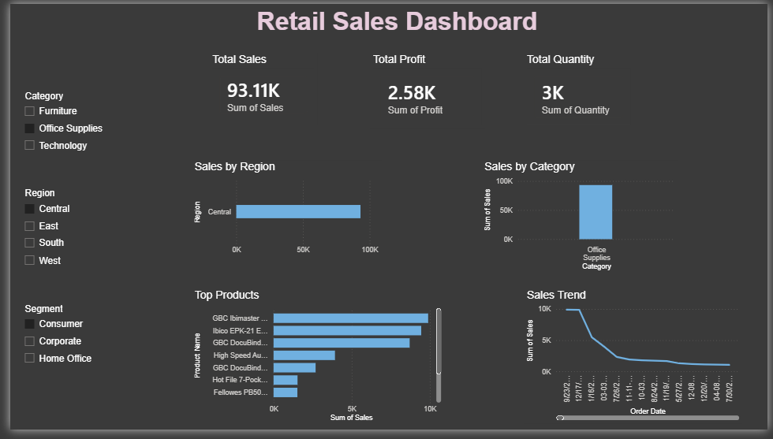

📊 Retail Sales Dashboard | Power BI

📌 Project Overview

This project showcases an interactive Retail Sales Dashboard developed using Microsoft Power BI with the Sample Superstore dataset. The dashboard transforms raw retail sales data into meaningful business insights through interactive visualizations and KPI reporting.

🎯 Business Objective

The goal of this dashboard is to help business users monitor sales performance, profitability, product performance, and regional trends to support data-driven decision-making.

📷 Dashboard Preview

📈 Key Performance Indicators

- 💰 Total Sales
- 📈 Total Profit
- 📦 Total Quantity Sold

📊 Dashboard Features

- KPI Cards
  - Total Sales
  - Total Profit
  - Total Quantity

- Sales by Category

- Sales by Region

- Sales Trend (Order Date)

- Top Products by Sales

- Interactive Filters
  - Category
  - Region
  - Segment

🛠 Tools Used

- Microsoft Power BI
- Microsoft Excel
- Data Visualization
- Business Analytics

📂 Dataset

**Dataset:** Sample Superstore

Columns include:

- Order Date
- Sales
- Profit
- Quantity
- Category
- Sub-Category
- Product Name
- Region
- Segment
- Customer ID

💡 Business Insights

- Technology category generated the highest sales.
- The West region achieved the highest sales.
- A few products contribute significantly to overall revenue.
- Interactive slicers enable dynamic business analysis.

🚀 Skills Demonstrated

- Power BI Dashboard Development
- KPI Reporting
- Business Analytics
- Data Visualization
- Interactive Reporting
- Business Insight Generation

 📁 Repository Contents

- Retail_Sales_Dashboard.pbix
- Dashboard.png
- Retail_Sales_Dashboard.pdf
- Sample_Superstore.xlsx
  
👩‍💻 Author
Shraddha Suryawanshi
MBA – Business Analytics
Aspiring Business Analyst | Data Analyst | Power BI Developer
GitHub: https://github.com/shraddhasuryawanshi027-cloud
